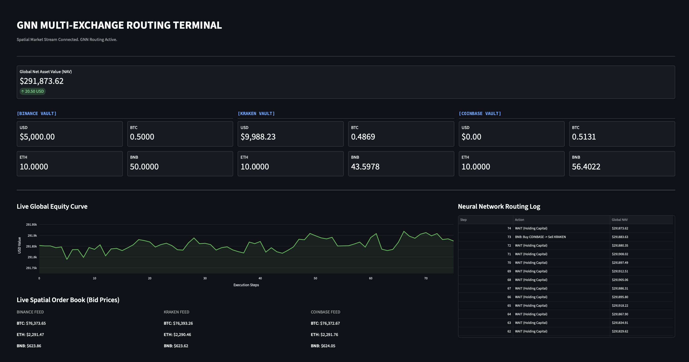

# Crypto RL: Multi-Exchange Spatial Arbitrage Framework

A Deep Reinforcement Learning (DRL) and Graph Neural Network (GNN) based simulation framework for low-latency cross-exchange (spatial) arbitrage in cryptocurrency markets.

This project is designed as a systems and infrastructure testbed rather than a profit-focused trading bot.

---

## Overview

This framework simulates how high-frequency trading systems exploit price differences across multiple exchanges without relying on slow blockchain transfers.

### Core Idea: Distributed Inventory

- Capital is pre-allocated across exchanges
- Arbitrage is executed via simultaneous buy and sell (atomic swaps)
- Eliminates blockchain transfer latency

---

## Pipeline Overview

```
Live Market Data (WebSocket / Simulated)
        ↓
State Construction (9-Node Graph)
        ↓
Graph Neural Network (GNN)
        ↓
Dueling Deep Q Network (DQN)
        ↓
Action Selection (19 Routing Actions)
        ↓
Execution Engine (Atomic Swap Simulation)
        ↓
PnL Reward + Next State
```

---

## Key Features

### Spatial Graph Representation
- 9 nodes = 3 assets × 3 exchanges
- Each node contains:
  - Normalized bid/ask prices
  - Order book volumes
  - Local inventory

### GNN-Based Feature Extraction
- Fully connected graph
- Captures cross-exchange price inefficiencies
- Handles non-Euclidean relationships

### Action Space
- Total actions: 19
  - 1: Wait (no trade)
  - 18: Cross-exchange arbitrage routes

### Dueling DQN Architecture
- Separates:
  - Value function (state quality)
  - Advantage function (action benefit)
- Helps avoid unnecessary trades in efficient markets

### Realistic Trading Constraints
- Exchange fees (0.1%)
- Slippage
- Strict inventory validation
- Prevents unrealistic capital assumptions

### Asynchronous System Design
- Non-blocking architecture
- Real-time data ingestion
- Optimized for low-latency decisions

---

## Streamlit Dashboard

The dashboard provides real-time monitoring of:
- Global Net Asset Value (NAV)
- Arbitrage execution events
- Fee impact vs profit

### Preview

```

```

---

## Project Structure

```

├── app.py                         # Streamlit dashboard
├── data_feed.py                  # Market data ingestion
├── env.py                        # Trading environment (MDP)
├── execution.py                  # Atomic swap logic
├── model.py                      # GNN + Dueling DQN
├── trainer.py                    # Training logic
├── main.py                       # Entry point (train/test)

├── gnn_spatial_model.pth         # Base trained model
├── gnn_spatial_model_15000.pth   # Fully trained model (recommended)

├── spatial_training_logs.csv     # Training logs
```

---

## Installation

```bash
git clone https://github.com/ayushhgupta1/gnn-drl-crypto-arbitrage.git
```

---

## Usage

### Run with Pretrained Model (Recommended)

No training required. Ensure the pretrained model file exists:

```
gnn_spatial_model_15000.pth
```

Run:

```bash
python main.py --mode demo --live    
```

---

### Train from Scratch

```bash
python main.py --mode train
```

- Trains for approximately 15,000 episodes
- Uses synthetic arbitrage signals during training

---

### Launch Dashboard

```bash
streamlit run app.py
```

---

## Expected Behavior

During testing:
- The agent predominantly selects:
  ```
  WAIT
  ```
- Trades occur only when spreads exceed the fee threshold (~0.22%)

This demonstrates real-world market efficiency and fee constraints.

---

## Model Performance

| Metric                 | Value        |
|----------------------|-------------|
| Training Episodes     | 15,000      |
| Inventory Violations  | 0%          |
| Decision Latency      | Milliseconds|
| Arbitrage Detection   | Yes         |
| Fee Awareness         | Yes         |

---

## Why This Project Matters

- Combines GNNs, DRL, and systems engineering
- Simulates real-world trading constraints
- Focuses on execution and latency rather than prediction
- Highlights sim-to-real challenges in financial systems

---

## Future Work

- Replace synthetic signals with real historical Level-2 data
- Add more exchanges and assets
- Improve execution realism (latency, partial fills)
- Integrate live exchange APIs (sandbox environments)

---

## Disclaimer

This project is intended for research and engineering purposes only.  
It does not guarantee profitability and should not be considered financial advice.

---
